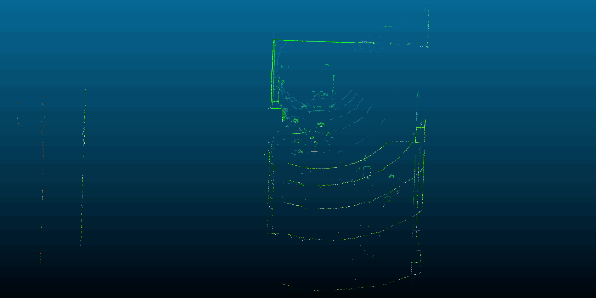

# icp-go

## Point Cloud Alignment using Point to Plane ICP:

Estimated Translation: X=-0.960, Y=0.0352, Z=-0.0625

Estimated Yaw: 0.002

Time Elapsed: 515.364292ms

Num Target Points: 22732

Num Source Points: 22732

